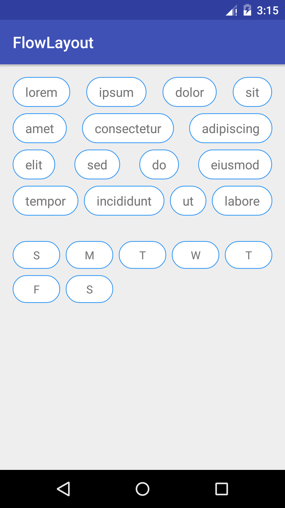

# FlowLayout

A FlowLayout for Android, which allows child views flow to next row when there is no enough space. The spacing between child views can be calculated by the FlowLayout so that the views are evenly placed.

<p align="center">

</p>


## Gradle

```
compile 'com.nex3z:flow-layout:0.1.0'
```


## Attributes

| Attribute              | Format                       | Description                                                                                         |
|------------------------|------------------------------|-----------------------------------------------------------------------------------------------------|
| flow                   | boolean                      | `true` to allow flow. `false` to restrict all child views in one row.                               |
| childSpacing           | `auto`/dimension             | The horizontal spacing between child views. Either `auto`, or a fixed size.                         |
| childSpacingForLastRow | `auto`/`align`/<br>dimension | The horizontal spacing between child views of the last row. Either `auto`, `align` or a fixed size. |
| rowSpacing             | `auto`/dimension             | The vertical spacing between rows. Either `auto`, or a fixed size.                                  |

`auto` means that the actual spacing is calculated as per the size of the `FlowLayout` and the number of child views (or rows), so that the child views (or rows) are placed evenly.

`align` in `childSpacingForLastRow` means that the horizontal spacing of the child views in the last row keeps the same with the spacing used in the row above. If there is only one row in `FlowLayout` and the `childSpacingForLastRow` is set to `align`, this value is ignored and the actual spacing is calculated using `childSpacing`.


## Licence

```
Copyright 2016 nex3z

Licensed under the Apache License, Version 2.0 (the "License");
you may not use this file except in compliance with the License.
You may obtain a copy of the License at

   http://www.apache.org/licenses/LICENSE-2.0

Unless required by applicable law or agreed to in writing, software
distributed under the License is distributed on an "AS IS" BASIS,
WITHOUT WARRANTIES OR CONDITIONS OF ANY KIND, either express or implied.
See the License for the specific language governing permissions and
limitations under the License.
```
